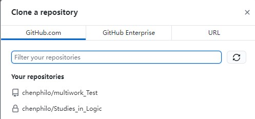
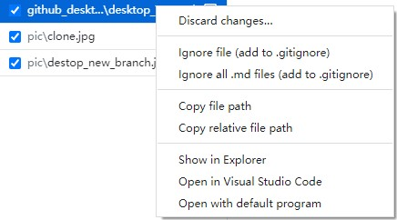
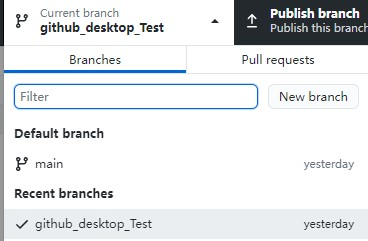
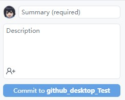
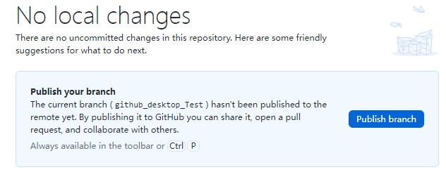
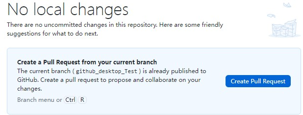

# github_desktop使用测试

### 下载github_desktop：

> [网址](https://desktop.github.com/)

### 登陆账号

> 按照要求

### 克隆仓库 clone repository

> 注意指定好放在的本地位置，操作基本上和网盘相似。
> 目前不清楚如何只克隆部分仓库，似乎git功能可以实现，但desktop没有现成选项。所以我目前想先把备份仓库和以后编辑使用的仓库分开，使得下载量较小。

### 打开方式

> githubdesktop下的界面是一堆白色，不能显示代码，我安装了vscode，选择用这个打开，也可选择其他的编辑器。

### 新建分支

### 新增、编辑文件

> 比网页方便了很多，可以直接在本地文件夹添加（保险起见，要新建分支），添加后就在vscode编辑。

### 提交

> 提交之后显示如下图：

> 这个时候我在网页端看，没有找到这个新分支，可见commit并没有把改动上传。于是我按这里的publish。

> 这个时候网页上就出现了新分支，可见改动上传了，接下来就可以pull了，操作和网页部分的一样。
